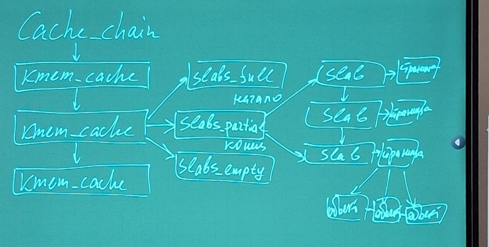
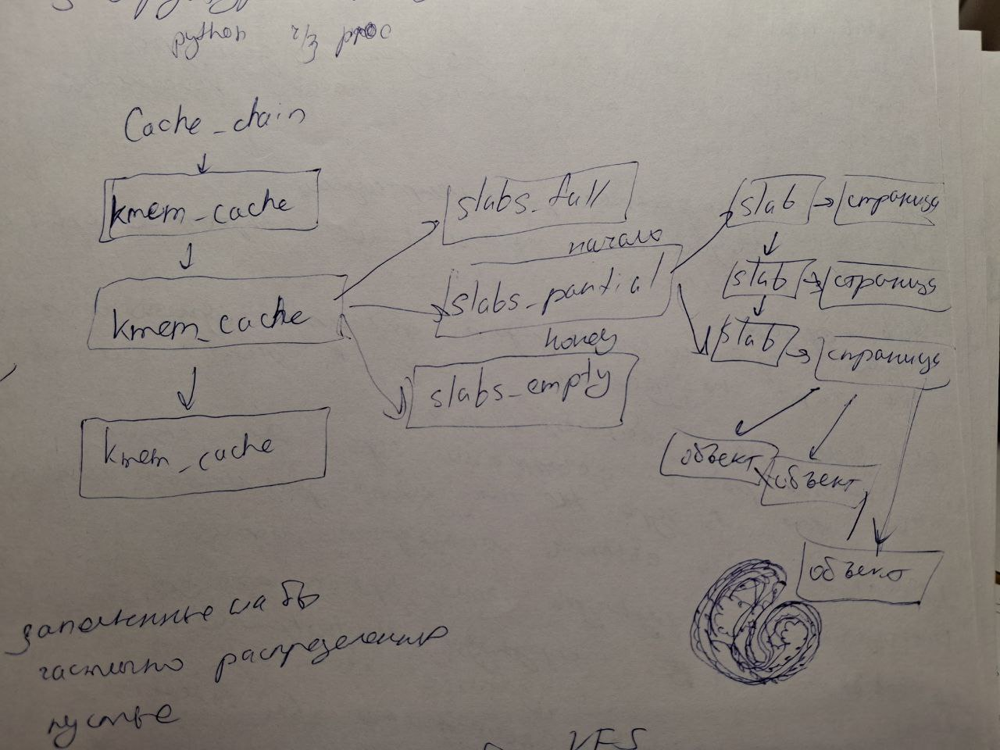

# Кеши
## dentry cache
dentry (directory entry) - создает на лету и является элементом пути в имени файла 

Поскольку чтение и запись в каталог с диска и создание соответствующего обьекта dentry требует значительного времи имеет смысл хранить в памяти обьекты, с которыми были закончены действия но они могут понадибиться позже. Пример в embox (лекция) - демонстирует как через inode и адрес блока на диске получить информацию о файле и доступ к нему.

*В чем смысл прохода по элементам каталога? - доступ к информации файла*

Например: часто файлы редактируются, копируются, выводятся на печать. Для максимальной эффективности обработки dentry linux использует cache dentry, который состоит из 2х видов структур:
1 - набор обьектов dentry in use (используемые)
2 - набор обьектов dentry unuse (не используемые)
3 - negative

hash table - чтобы быстро получать обьект dentry связанный с заданным именем файла, или с заданной территорией в ядре.

Если треуемый обьект не включаен в dentry cache, то hash func возвращает 0. 

dentry cache действует как контроллер для cache inode.

inode в памяти ядра, которые связаны с неиспользуемыми dentry не отбрасываются до тех пор пока dentry cache их спользует. Т о обьекты inode хранятся в RAM и на них можно быстро ссылаться посредством соответствующих dentry.

Все dentry unused включаены в двусвязный список LRU (наименее используемый в последнее время)

Каждый dentry в состоянии in use вставляет двусвязный список, который определяется полем i_dentry, соответствующего обьекта inode. В struct inode есть поле i_dentry.

Т к на каждый inode может быть несколько жестких ссылок, т к имя файла не является идентификатором файла, такой список является обязательным.

Обьект dentry in use может стать отрицательным при удалении последней жесткой ссылки на соответствубщий файл. В этом случае обьект dentry перемещается в список LRU unused.
```C
struct inode {
    ...
    union {
		struct hlist_head	i_dentry;
		struct rcu_head		i_rcu;
	};
    ...
}
```

Все связные списки определяются структурой struct hlist_head

cache inode может содердать обьект inode, т е проинициализированные структуры inode. Но к inode мы обращаемся в конце прохода по dentry и дальше работаем с inode.


## slab cache
Если dentry cache нужен для ускорения доступа к файла, сам dentry нас не интересует, нас интересует конечный пункт - физический файл в которм хранится информация.

slab cache - совсем другая задача - **устранение фрагментации**

Память выделяется страницами - имеется скрытая фрагментация (мы это видели в лабе proc - mem)

**Идея - проинициализированные обьекты одного и того же типа не удалять, а сохранять в одном stab cache.** 

slab cache не работают с кучей, они работают с обьектами ядра, это связано с тем что в ядре не так много типов структур которые могут создаваться, при этом эти обьекты ядра как правило многократно использются. А инициализация любого обьекта это время и это занимаемый обьем памяти, при этом память выделяется страницами. 

Смысл slab cache:
Пример: есть обьект 64байт. Многократно создются обьекты которые описываются такой структурой. В одной странице может поместиться 64 таких обьекта. Или 64 страница или 1 страница в которой может поместиться 64 таких обьекта





## Курсовая
Вопрос кеширования и мониторинга кешей.

Связать malloc структуры 16 байт. В ядре есть cache на 16, 64... байт.

Когда в приложении вызаваем malloc структуры 16 байт -> k_malloc, связано ли это со slab-кеш 16 байт? или построить через maps, сравнить информацию.

# Задание лаба VFS

есть функция fill_super, кот используется в mount_bdev. Можно вызываеть mount_ddev - в расчете на то что мы создаем виртуальный диск

litter

kill_litter_super() - 

generic_shutdown_super()

Предлагается создать свой slab cache, надо обьявить свою структуру. и в перечне slub cache увидем свой slab

Создаем несколько обьектов


