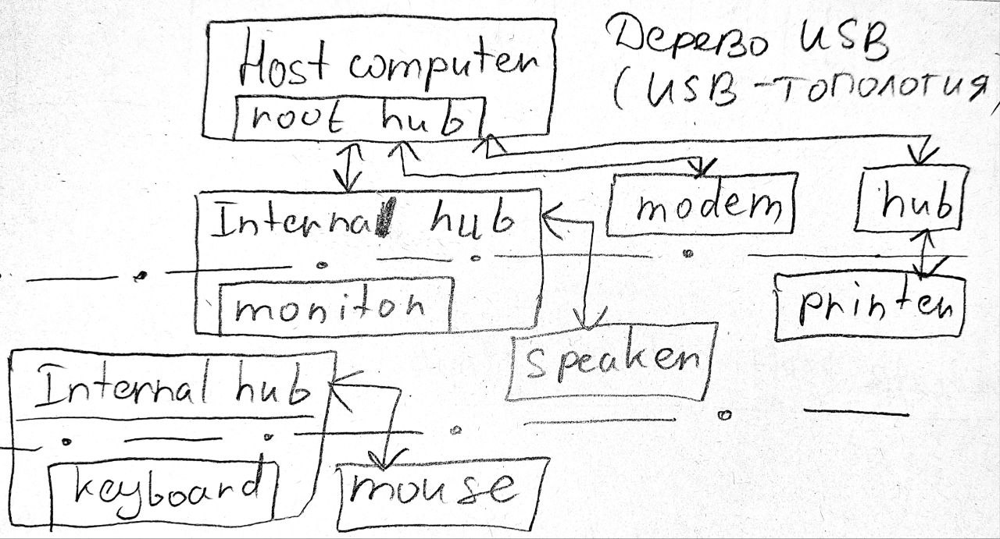
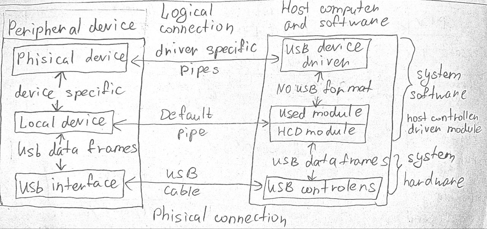

4.06.25 15:00

# Управление внешними устройствами
Под внешними устройствами в linux имеют ввиду специальные файла устройств.

c, v - спец файлы символьного и блочнго типа. Это сделано чтобы обспечить работу с внешними устройствами как с файлами. Когда пишем или читаем инф-ю обращась к внешнему устройств - исп сист вызовы для чтения и записи в файл.

Все запоминающие устройства относятся к block-device

ФУ может быть "открыт" "закрыт" из него можно "чиать/писать". Как правило ОС каждому внешему устройству ставится в соответствие 1 спец файл. Их можно увидеть в каталоге /dev. ls -l в данном каталоге выведет:
crw-rw-rw- 1 root root 1,3 apr11 2002 null // сюда перенаправлялись файлы 0, 1, 2 в демоне (/dev/null)
--||--                 1,5 --||--     zero

Каждое устройство имеет 2 числа кот отражают идентиф устройство в системе: major,minor (система старшего и младшего номеров).

Страший и младший номер идентиф драйвер устройства (устройство может быть одно, а драйверов на него много). /dev/null и /dev/zero управлят драйвером 1. Виртуальные консоли (терминалы) упраляют драйвером 4.  Младший номер позволяет различать эти устройства.

Яркий пример: диск-имеет страший номер, разделы-имеют младшие номера.

В ядре определен тип dev_t. Это 32х разрядное число. POSIX определяет существование типа но не оговаривает формат полей. 

В linux форматируется как: 12бит для старшего номер и 20 бит для младшего.
```C
/ include / linux / types.h
typedef u32 __kernel_dev_t;
typedef __kernel_dev_t		dev_t;
```

В ядре есть предупреждение о том что наш код не должен делать какие-либо предположения о внутренней организации номеров устройств. Он должен использовать набор макросов из библиотеки linux:
```C
#define MAJOR(dev)
#define MINOR(dev)
#define MKDEV(ma,mi) // в dev_t
```
Функция выдеяет диапазон номеров символьный устройств. Старший номер выбирается динамически и функция возвращает его одновременно с младшим номером через dev. Вызов этой функции замеит ряд действий
```C
/* alloc_chrdev_region() - register a range of char device numbers
 * @dev: output parameter for first assigned number
 * @baseminor: first of the requested range of minor numbers
 * @count: the number of minor numbers required
 * @name: the name of the associated device or driver
 *
 * Allocates a range of char device numbers.  The major number will be
 * chosen dynamically, and returned (along with the first minor number)
 * in @dev.  Returns zero or a negative error code. */
int alloc_chrdev_region(dev_t *dev, unsigned baseminor, unsigned count, const char *name) {
	struct char_device_struct *cd;
	cd = __register_chrdev_region(0, baseminor, count, name);
	if (IS_ERR(cd))
		return PTR_ERR(cd);
	*dev = MKDEV(cd->major, cd->baseminor);
	return 0;
}

```

##  Пример драйвера устройства кот вешается мышь
```C
#define IRQ_NO 11
...
static DELACRE_WORK(work, workqueue_fu);
...
static const struct file_operations fops = {
    .owner          = THIS_MODULE,
    .read           = etx_read,
    .write          = etx_write,
    .open           = etx_open,
    .release        = etx_release,
};
static int __init etx_driver_init(void)
{
        /*Allocating Major number*/
        if ((alloc_chrdev_region(&dev, 0, 1, "etx_Dev")) < 0) {
                pr_info("Cannot allocate major number\n");
                return -1;
        }
        pr_info("Major = %d Minor = %d\n", MAJOR(dev), MINOR(dev));

        /*Creating cdev structure*/
        cdev_init(&etx_cdev, &fops);

        /*Adding character device to the system*/
        if ((cdev_add(&etx_cdev, dev, 1)) < 0) {
                pr_info("Cannot add the device to the system\n");
                goto r_class;
        }

        /*Creating struct class*/
        dev_class = class_create(THIS_MODULE, "etx_class");
        if (IS_ERR(dev_class)) {
                pr_info("Cannot create the struct class\n");
                goto r_class;
        }

        /*Creating device*/
        if (IS_ERR(device_create(dev_class, NULL, dev, NULL, "etx_device"))) {
                pr_info("Cannot create the Device 1\n");
                goto r_device;
        }

        /*Creating a directory in /sys/kernel/ */
        kobj_ref = kobject_create_and_add("etx_sysfs", kernel_kobj);

        /*Creating sysfs file for etx_value*/
        if (sysfs_create_file(kobj_ref, &etx_attr.attr)) {
                pr_err("Cannot create sysfs file......\n");
                goto r_sysfs;
        }
        pr_info("Device Driver Insert...Done!!!\n");
        return 0;

r_sysfs:
        kobject_put(kobj_ref);
        sysfs_remove_file(kernel_kobj, &etx_attr.attr);

r_device:
        class_destroy(dev_class);
r_class:
        unregister_chrdev_region(dev, 1);
        cdev_del(&etx_cdev);
        return -1;
}
```
 
```C
#include <linux/module.h>
#include <linux/fs.h>
#include <linux/cdev.h>
#include <linux/device.h>

static dev_t dev;
static struct cdev etx_cdev;
static struct class *dev_class;
static const struct file_operations fops = {
    .owner = THIS_MODULE,
    .read = etx_read, .write = etx_write,
    .open = etx_open, .release = etx_release,};
static int __init etx_driver_init(void){
    if (alloc_chrdev_region(&dev, 0, 1, "etx_Dev") < 0) { err}
    /* Initialize and add character device */
    cdev_init(&etx_cdev, &fops);
    if (cdev_add(&etx_cdev, dev, 1) < 0) {err}
    /* Create device class and device node */
    dev_class = class_create(THIS_MODULE, "etx_class");
    if (IS_ERR(dev_class)) {err}
    if (IS_ERR(device_create(dev_class, NULL, dev, NULL, "etx_device"))) {err}
    return 0;}
static void __exit etx_driver_exit(void){
    device_destroy(dev_class, dev);
    class_destroy(dev_class);
    cdev_del(&etx_cdev);
    unregister_chrdev_region(dev, 1);}
module_init(etx_driver_init); module_exit(etx_driver_exit);
```

## 3 типа драйверов устройств
1 - драйвер встроеные в ядро (автоматически обнаруж системой)
2 - реализованные как загружаемые модули ядра (звуковые, сетевые карты). 
3 - код поделен между ядром и специальной утилитой, например у драйвера принтера ядро отовечает за взаимодействие с || портом, а формирование сигналов осуществляет система печали lpd (пользовательский демон)

Файлы модулей ядра располагаются в подкаталога каталоов /lib/modules
/etc/modules–модули, загружаемые при старте системы.
/proc/modules-список загруженных модулей в текущий момент.(lsmod)

Часто подчистему предназнач для работы с внешними устройствами, наз подсистемой ввода/вывода (это самая сложная подсистема ОС). Для реализации взаимодействия с внешними устройствами написан очень большой процент кода ядра.

Самой низкоуровненой структурой для работы с внешними устройствами является struct device

### struct device
```C
/ include / linux / device.h
/**
 * struct device - The basic device structure
 * @parent:	The device's "parent" device, the device to which it is attached.
 * 		In most cases, a parent device is some sort of bus or host
 * 		controller. If parent is NULL, the device, is a top-level device,
 * 		which is not usually what you want.
 * @p:		Holds the private data of the driver core portions of the device.
 * 		See the comment of the struct device_private for detail.
 * @kobj:	A top-level, abstract class from which other classes are derived.
 * @init_name:	Initial name of the device.
 * @type:	The type of device.
 * 		This identifies the device type and carries type-specific
 * 		information.
 * @mutex:	Mutex to synchronize calls to its driver.
 * @bus:	Type of bus device is on.
 * @driver:	Which driver has allocated this
 * @platform_data: Platform data specific to the device.
 * 		Example: For devices on custom boards, as typical of embedded
 * 		and SOC based hardware, Linux often uses platform_data to point
 * 		to board-specific structures describing devices and how they
 * 		are wired.  That can include what ports are available, chip
 * 		variants, which GPIO pins act in what additional roles, and so
 * 		on.  This shrinks the "Board Support Packages" (BSPs) and
 * 		minimizes board-specific #ifdefs in drivers.
 * @driver_data: Private pointer for driver specific info.
 * @links:	Links to suppliers and consumers of this device.
 * @power:	For device power management.
 *		See Documentation/driver-api/pm/devices.rst for details.
 * @pm_domain:	Provide callbacks that are executed during system suspend,
 * 		hibernation, system resume and during runtime PM transitions
 * 		along with subsystem-level and driver-level callbacks.
 * @em_pd:	device's energy model performance domain
 * @pins:	For device pin management.
 *		See Documentation/driver-api/pin-control.rst for details.
 * @msi:	MSI related data
 * @numa_node:	NUMA node this device is close to.
 * @dma_ops:    DMA mapping operations for this device.
 * @dma_mask:	Dma mask (if dma'ble device).
 * @coherent_dma_mask: Like dma_mask, but for alloc_coherent mapping as not all
 * 		hardware supports 64-bit addresses for consistent allocations
 * 		such descriptors.
 * @bus_dma_limit: Limit of an upstream bridge or bus which imposes a smaller
 *		DMA limit than the device itself supports.
 * @dma_range_map: map for DMA memory ranges relative to that of RAM
 * @dma_parms:	A low level driver may set these to teach IOMMU code about
 * 		segment limitations.
 * @dma_pools:	Dma pools (if dma'ble device).
 * @dma_mem:	Internal for coherent mem override.
 * @cma_area:	Contiguous memory area for dma allocations
 * @dma_io_tlb_mem: Software IO TLB allocator.  Not for driver use.
 * @dma_io_tlb_pools:	List of transient swiotlb memory pools.
 * @dma_io_tlb_lock:	Protects changes to the list of active pools.
 * @dma_uses_io_tlb: %true if device has used the software IO TLB.
 * @archdata:	For arch-specific additions.
 * @of_node:	Associated device tree node.
 * @fwnode:	Associated device node supplied by platform firmware.
 * @devt:	For creating the sysfs "dev".
 * @id:		device instance
 * @devres_lock: Spinlock to protect the resource of the device.
 * @devres_head: The resources list of the device.
 * @class:	The class of the device.
 * @groups:	Optional attribute groups.
 * @release:	Callback to free the device after all references have
 * 		gone away. This should be set by the allocator of the
 * 		device (i.e. the bus driver that discovered the device).
 * @iommu_group: IOMMU group the device belongs to.
 * @iommu:	Per device generic IOMMU runtime data
 * @physical_location: Describes physical location of the device connection
 *		point in the system housing.
 * @removable:  Whether the device can be removed from the system. This
 *              should be set by the subsystem / bus driver that discovered
 *              the device.
 *
 * @offline_disabled: If set, the device is permanently online.
 * @offline:	Set after successful invocation of bus type's .offline().
 * @of_node_reused: Set if the device-tree node is shared with an ancestor
 *              device.
 * @state_synced: The hardware state of this device has been synced to match
 *		  the software state of this device by calling the driver/bus
 *		  sync_state() callback.
 * @can_match:	The device has matched with a driver at least once or it is in
 *		a bus (like AMBA) which can't check for matching drivers until
 *		other devices probe successfully.
 * @dma_coherent: this particular device is dma coherent, even if the
 *		architecture supports non-coherent devices.
 * @dma_ops_bypass: If set to %true then the dma_ops are bypassed for the
 *		streaming DMA operations (->map_* / ->unmap_* / ->sync_*),
 *		and optionall (if the coherent mask is large enough) also
 *		for dma allocations.  This flag is managed by the dma ops
 *		instance from ->dma_supported.
 * @dma_skip_sync: DMA sync operations can be skipped for coherent buffers.
 * @dma_iommu: Device is using default IOMMU implementation for DMA and
 *		doesn't rely on dma_ops structure.
 *
 * At the lowest level, every device in a Linux system is represented by an
 * instance of struct device. The device structure contains the information
 * that the device model core needs to model the system. Most subsystems,
 * however, track additional information about the devices they host. As a
 * result, it is rare for devices to be represented by bare device structures;
 * instead, that structure, like kobject structures, is usually embedded within
 * a higher-level representation of the device.
 */
struct device {
	struct kobject kobj;
	struct device		*parent;
	struct device_private	*p;
	const char		*init_name; /* initial name of the device */
	const struct device_type *type;

	const struct bus_type	*bus;	/* type of bus device is on */
	struct device_driver *driver;	/* which driver has allocated this device */
	void		*platform_data;	/* Platform specific data, device core doesn't touch it */
	void		*driver_data;	/* Driver data, set and get with  dev_set_drvdata/dev_get_drvdata */
	struct mutex		mutex;	/* mutex to synchronize calls to its driver. */

	struct dev_links_info	links;
	struct dev_pm_info	power;
	struct dev_pm_domain	*pm_domain;

#ifdef CONFIG_ENERGY_MODEL
	struct em_perf_domain	*em_pd;
#endif
#ifdef CONFIG_PINCTRL
	struct dev_pin_info	*pins;
#endif
	struct dev_msi_info	msi;
#ifdef CONFIG_ARCH_HAS_DMA_OPS
	const struct dma_map_ops *dma_ops;
#endif
	u64		*dma_mask;	/* dma mask (if dma'able device) */
	u64		coherent_dma_mask;/* Like dma_mask, but for
					     alloc_coherent mappings as
					     not all hardware supports
					     64 bit addresses for consistent
					     allocations such descriptors. */
	u64		bus_dma_limit;	/* upstream dma constraint */
	const struct bus_dma_region *dma_range_map;
	struct device_dma_parameters *dma_parms;
	struct list_head	dma_pools;	/* dma pools (if dma'ble) */
...
#ifdef CONFIG_NUMA
	int		numa_node;	/* NUMA node this device is close to */
#endif
	dev_t			devt;	/* dev_t, creates the sysfs "dev" */
	u32			id;	/* device instance */
...};
```
### 

Эта структура инициализир-ся когда мы написав свой драйвер, вызываем на нем свои фукции (автоматически).

msi - message signal interript- способ доставки процессору информации об аппаратном прерывании.

/proc/interrupts- номер_IRQ; счётчик прерываний на каждый процессор; вид прерывания; устройство, ассоциированное с данным прерыванием (в лабе было: i8042 my_handler)
(IO-APIC, PCI-MSI)

numa - современная архитектура чипов процессоров


### struct device_driver
```C
/ include / linux / device / driver.h
/**
 * struct device_driver - The basic device driver structure
 * @name:	Name of the device driver.
 * @bus:	The bus which the device of this driver belongs to.
 * @owner:	The module owner.
 * @mod_name:	Used for built-in modules.
 * @suppress_bind_attrs: Disables bind/unbind via sysfs.
 * @probe_type:	Type of the probe (synchronous or asynchronous) to use.
 * @of_match_table: The open firmware table.
 * @acpi_match_table: The ACPI match table.
 * @probe:	Called to query the existence of a specific device,
 *		whether this driver can work with it, and bind the driver
 *		to a specific device.
 * @sync_state:	Called to sync device state to software state after all the
 *		state tracking consumers linked to this device (present at
 *		the time of late_initcall) have successfully bound to a
 *		driver. If the device has no consumers, this function will
 *		be called at late_initcall_sync level. If the device has
 *		consumers that are never bound to a driver, this function
 *		will never get called until they do.
 * @remove:	Called when the device is removed from the system to
 *		unbind a device from this driver.
 * @shutdown:	Called at shut-down time to quiesce the device.
 * @suspend:	Called to put the device to sleep mode. Usually to a
 *		low power state.
 * @resume:	Called to bring a device from sleep mode.
 * @groups:	Default attributes that get created by the driver core
 *		automatically.
 * @dev_groups:	Additional attributes attached to device instance once
 *		it is bound to the driver.
 * @pm:		Power management operations of the device which matched
 *		this driver.
 * @coredump:	Called when sysfs entry is written to. The device driver
 *		is expected to call the dev_coredump API resulting in a
 *		uevent.
 * @p:		Driver core's private data, no one other than the driver
 *		core can touch this.
 *
 * The device driver-model tracks all of the drivers known to the system.
 * The main reason for this tracking is to enable the driver core to match
 * up drivers with new devices. Once drivers are known objects within the
 * system, however, a number of other things become possible. Device drivers
 * can export information and configuration variables that are independent
 * of any specific device. */
struct device_driver {
	const char		*name;
	const struct bus_type	*bus;

	struct module		*owner;
	const char		*mod_name;	/* used for built-in modules */

	bool suppress_bind_attrs;	/* disables bind/unbind via sysfs */
	enum probe_type probe_type;

	const struct of_device_id	*of_match_table;
	const struct acpi_device_id	*acpi_match_table;

	int (*probe) (struct device *dev);
	void (*sync_state)(struct device *dev);
	int (*remove) (struct device *dev);
	void (*shutdown) (struct device *dev);
	int (*suspend) (struct device *dev, pm_message_t state);
	int (*resume) (struct device *dev);
	const struct attribute_group **groups;
	const struct attribute_group **dev_groups;

	const struct dev_pm_ops *pm;
	void (*coredump) (struct device *dev);

	struct driver_private *p;
};
```


###

6.06.25
Драйвер - спец програмное обеспечение кот управляет внешним устройством. 

Можно выделить драйвера нижнего уровня, они пишутся разработчиками внешних устройств. Современные ОС позволяню на драйвера нижнего уровня повесить драйвера более высокового уровня.

В Windows - это декларированная система - стек драйверов. (регистрируем свои драйвера через реестр)
В Linux - загружаемые модули ядра

Самой общей структурой описаия драйверов является struct device_driver. Она также декларирует точки входа:
probe - Вызывается при обнаружении устройства,
remove - при отключении устройства
shutdown-при выключении системы
suspend-при переходе системы в спящий режим
resume-при выходе системы из спящего режима.
coredump-Сохранить отладочную информацию (при сбое)


## USB-шина
Сначала была шина ISA, потом PCI
USB-шина-наиболее поздняя(надстройка над шиной PCI), последовательная передача данных, 

Смысл развития USB-шины в увеличении скорости передачи данных
Все usb-устройства раб по принципу горячего подключения.

Дерево USB


hub-сетевой концентратор (повторитель) через который соединяются узлы системы. Узел hub предназначен для распространения сигнала (кот выполняет задачу передачи данных в техническом устройстве)
host-компьютер- корневой узел usb-дерева. Содержит implicit(неявные, не подключаенные) узлы.

Все шины предназначены для того чтобы подключать устройства

диаграмма


В процессе передачи данных выполняются след-е действия:
1-usb-устройство инициалиирует передачу, используя функции интерфейса usb-драйвера, выдавая запросы в модулю usb-драйвера (polling)
2-usb-драйвер отсылает запросы HCD-модулю (host controller driver module)
3-HCD-модуль делит запросы на отдельные транзакции (учитывая особенности шины и характеристики usb-устройства) и планирует их
4-hardware(аппаратная часть) выполняет или завершает транзакции

Т о транзакиця определяется usb-шиной и устройство является полностью зависимым

Базовым понятием при передаче данных между устройством и шиной является URB(USB request block) struct urb

Внутреннаяя структура urb-шины никак в ПО не затргивается.

При работе с usb-устройствами обмен данными идет между конечными точки (endpoint). Каждый пакет каждой транзакции содержит номер конечной точки на устройсте. При подключении устройства драйверы считывают с утройста список конечных точек и создют управляюищие структуры данных для взаимодействия с каждой конечной точкой устройства. Совокупность конечной точки и структур данных в ядре ОС наз каталом (pipe). pipe-одноаправленная передача данных

Сущ 4 режима передачи данных:
1-control-двунаправленная передача данных предназнач для обмена с устройствами короткими пакетами типа воспрос-ответ. Исп ПО для выдачи команд на usb-устройство. Обычно осущ конечной точкой 0 usb-устройство
2-isochronous-изохронная передача данных(режим обмена данными), гарантирует опр-ю скорость доставки пакетов. Передача осущ без подтвержения приема. Передача аудио и видео инф
3-interrupt-короткие передачи на шине (до 64байт на полной скорости передачи на шине и до 8байт на низкой). Для ввода символов и координат. Имею спонтанный характер и должны обслуживаться не меденнее чем того требует устройство.
4-bulk-поточная передача данных. Исп-ся усройствами принимаюими или оправляющими большой обьем данных но не требующими определенной сокорости передачи. Имеют самый низкий приоритет передачи (передаются в последнюю очередь), т к занимают всю свобоную полосу пропускаия шины.

struct usb_driver—структура, описывающая драйвер USB-устройства в ядре. Исп для управления USB-устройствами.
Ее точки входа на самом деле раб с интерфейсом struct usb_interface. Важнейшей составляющей свляется const struct usb_device_id *id_table; (структура идетифицирующая стройство) - Таблица идентификаторов поддерживаемых устройств

struct usb_device_drive-исп для работы с кокретными USB-устройством, а не интерфейсом
Пример регистрации своего USB-устройства
```C
static int my_probe(struct usb_interface *intf, const struct usb_device_id *id) {
    printk(KERN_INFO "USB Mouse подключена!\n");
    return 0; }
static void my_disconnect(struct usb_interface *intf) {
    printk(KERN_INFO "USB Mouse отключена\n"); }
static const struct usb_device_id my_usb_table[] = {
    { USB_DEVICE(VID, PID) },  
    { }  };
static struct usb_driver my_usb_driver = {
    .name = "usb_mouse_driver", .probe = my_probe,
    .disconnect = my_disconnect, .id_table = my_table,};
static int __init myinit(void) {
    ... return usb_register(&my_usb_driver);}
static void __exit my_exit(void){
    usb_deregister(&my_usb_driver);}
module_init(my_init); module_exit(my_exit);
```
 
### struct urb
```C
/**
 * struct urb - USB Request Block
 * @urb_list: For use by current owner of the URB.
 * @anchor_list: membership in the list of an anchor
 * @anchor: to anchor URBs to a common mooring
 * @ep: Points to the endpoint's data structure.  Will eventually
 *	replace @pipe.
 * @pipe: Holds endpoint number, direction, type, and more.
 *	Create these values with the eight macros available;
 *	usb_{snd,rcv}TYPEpipe(dev,endpoint), where the TYPE is "ctrl"
 *	(control), "bulk", "int" (interrupt), or "iso" (isochronous).
 *	For example usb_sndbulkpipe() or usb_rcvintpipe().  Endpoint
 *	numbers range from zero to fifteen.  Note that "in" endpoint two
 *	is a different endpoint (and pipe) from "out" endpoint two.
 *	The current configuration controls the existence, type, and
 *	maximum packet size of any given endpoint.
 * @stream_id: the endpoint's stream ID for bulk streams
 * @dev: Identifies the USB device to perform the request.
 * @status: This is read in non-iso completion functions to get the
 *	status of the particular request.  ISO requests only use it
 *	to tell whether the URB was unlinked; detailed status for
 *	each frame is in the fields of the iso_frame-desc.
 * @transfer_flags: A variety of flags may be used to affect how URB
 *	submission, unlinking, or operation are handled.  Different
 *	kinds of URB can use different flags.
 * @transfer_buffer:  This identifies the buffer to (or from) which the I/O
 *	request will be performed unless URB_NO_TRANSFER_DMA_MAP is set
 *	(however, do not leave garbage in transfer_buffer even then).
 *	This buffer must be suitable for DMA; allocate it with
 *	kmalloc() or equivalent.  For transfers to "in" endpoints, contents
 *	of this buffer will be modified.  This buffer is used for the data
 *	stage of control transfers.
 * @transfer_dma: When transfer_flags includes URB_NO_TRANSFER_DMA_MAP,
 *	the device driver is saying that it provided this DMA address,
 *	which the host controller driver should use in preference to the
 *	transfer_buffer.
 * @sg: scatter gather buffer list, the buffer size of each element in
 * 	the list (except the last) must be divisible by the endpoint's
 * 	max packet size if no_sg_constraint isn't set in 'struct usb_bus'
 * @num_mapped_sgs: (internal) number of mapped sg entries
 * @num_sgs: number of entries in the sg list
 * @transfer_buffer_length: How big is transfer_buffer.  The transfer may
 *	be broken up into chunks according to the current maximum packet
 *	size for the endpoint, which is a function of the configuration
 *	and is encoded in the pipe.  When the length is zero, neither
 *	transfer_buffer nor transfer_dma is used.
 * @actual_length: This is read in non-iso completion functions, and
 *	it tells how many bytes (out of transfer_buffer_length) were
 *	transferred.  It will normally be the same as requested, unless
 *	either an error was reported or a short read was performed.
 *	The URB_SHORT_NOT_OK transfer flag may be used to make such
 *	short reads be reported as errors.
 * @setup_packet: Only used for control transfers, this points to eight bytes
 *	of setup data.  Control transfers always start by sending this data
 *	to the device.  Then transfer_buffer is read or written, if needed.
 * @setup_dma: DMA pointer for the setup packet.  The caller must not use
 *	this field; setup_packet must point to a valid buffer.
 * @start_frame: Returns the initial frame for isochronous transfers.
 * @number_of_packets: Lists the number of ISO transfer buffers.
 * @interval: Specifies the polling interval for interrupt or isochronous
 *	transfers.  The units are frames (milliseconds) for full and low
 *	speed devices, and microframes (1/8 millisecond) for highspeed
 *	and SuperSpeed devices.
 * @error_count: Returns the number of ISO transfers that reported errors.
 * @context: For use in completion functions.  This normally points to
 *	request-specific driver context.
 * @complete: Completion handler. This URB is passed as the parameter to the
 *	completion function.  The completion function may then do what
 *	it likes with the URB, including resubmitting or freeing it.
 * @iso_frame_desc: Used to provide arrays of ISO transfer buffers and to
 *	collect the transfer status for each buffer.
 *
 * This structure identifies USB transfer requests.  URBs must be allocated by
 * calling usb_alloc_urb() and freed with a call to usb_free_urb().
 * Initialization may be done using various usb_fill_*_urb() functions.  URBs
 * are submitted using usb_submit_urb(), and pending requests may be canceled
 * using usb_unlink_urb() or usb_kill_urb().
 *
 * Data Transfer Buffers:
 *
 * Normally drivers provide I/O buffers allocated with kmalloc() or otherwise
 * taken from the general page pool.  That is provided by transfer_buffer
 * (control requests also use setup_packet), and host controller drivers
 * perform a dma mapping (and unmapping) for each buffer transferred.  Those
 * mapping operations can be expensive on some platforms (perhaps using a dma
 * bounce buffer or talking to an IOMMU),
 * although they're cheap on commodity x86 and ppc hardware.
 *
 * Alternatively, drivers may pass the URB_NO_TRANSFER_DMA_MAP transfer flag,
 * which tells the host controller driver that no such mapping is needed for
 * the transfer_buffer since
 * the device driver is DMA-aware.  For example, a device driver might
 * allocate a DMA buffer with usb_alloc_coherent() or call usb_buffer_map().
 * When this transfer flag is provided, host controller drivers will
 * attempt to use the dma address found in the transfer_dma
 * field rather than determining a dma address themselves.
 *
 * Note that transfer_buffer must still be set if the controller
 * does not support DMA (as indicated by hcd_uses_dma()) and when talking
 * to root hub. If you have to transfer between highmem zone and the device
 * on such controller, create a bounce buffer or bail out with an error.
 * If transfer_buffer cannot be set (is in highmem) and the controller is DMA
 * capable, assign NULL to it, so that usbmon knows not to use the value.
 * The setup_packet must always be set, so it cannot be located in highmem.
 *
 * Initialization:
 *
 * All URBs submitted must initialize the dev, pipe, transfer_flags (may be
 * zero), and complete fields.  All URBs must also initialize
 * transfer_buffer and transfer_buffer_length.  They may provide the
 * URB_SHORT_NOT_OK transfer flag, indicating that short reads are
 * to be treated as errors; that flag is invalid for write requests.
 *
 * Bulk URBs may
 * use the URB_ZERO_PACKET transfer flag, indicating that bulk OUT transfers
 * should always terminate with a short packet, even if it means adding an
 * extra zero length packet.
 *
 * Control URBs must provide a valid pointer in the setup_packet field.
 * Unlike the transfer_buffer, the setup_packet may not be mapped for DMA
 * beforehand.
 *
 * Interrupt URBs must provide an interval, saying how often (in milliseconds
 * or, for highspeed devices, 125 microsecond units)
 * to poll for transfers.  After the URB has been submitted, the interval
 * field reflects how the transfer was actually scheduled.
 * The polling interval may be more frequent than requested.
 * For example, some controllers have a maximum interval of 32 milliseconds,
 * while others support intervals of up to 1024 milliseconds.
 * Isochronous URBs also have transfer intervals.  (Note that for isochronous
 * endpoints, as well as high speed interrupt endpoints, the encoding of
 * the transfer interval in the endpoint descriptor is logarithmic.
 * Device drivers must convert that value to linear units themselves.)
 *
 * If an isochronous endpoint queue isn't already running, the host
 * controller will schedule a new URB to start as soon as bandwidth
 * utilization allows.  If the queue is running then a new URB will be
 * scheduled to start in the first transfer slot following the end of the
 * preceding URB, if that slot has not already expired.  If the slot has
 * expired (which can happen when IRQ delivery is delayed for a long time),
 * the scheduling behavior depends on the URB_ISO_ASAP flag.  If the flag
 * is clear then the URB will be scheduled to start in the expired slot,
 * implying that some of its packets will not be transferred; if the flag
 * is set then the URB will be scheduled in the first unexpired slot,
 * breaking the queue's synchronization.  Upon URB completion, the
 * start_frame field will be set to the (micro)frame number in which the
 * transfer was scheduled.  Ranges for frame counter values are HC-specific
 * and can go from as low as 256 to as high as 65536 frames.
 *
 * Isochronous URBs have a different data transfer model, in part because
 * the quality of service is only "best effort".  Callers provide specially
 * allocated URBs, with number_of_packets worth of iso_frame_desc structures
 * at the end.  Each such packet is an individual ISO transfer.  Isochronous
 * URBs are normally queued, submitted by drivers to arrange that
 * transfers are at least double buffered, and then explicitly resubmitted
 * in completion handlers, so
 * that data (such as audio or video) streams at as constant a rate as the
 * host controller scheduler can support.
 *
 * Completion Callbacks:
 *
 * The completion callback is made in_interrupt(), and one of the first
 * things that a completion handler should do is check the status field.
 * The status field is provided for all URBs.  It is used to report
 * unlinked URBs, and status for all non-ISO transfers.  It should not
 * be examined before the URB is returned to the completion handler.
 *
 * The context field is normally used to link URBs back to the relevant
 * driver or request state.
 *
 * When the completion callback is invoked for non-isochronous URBs, the
 * actual_length field tells how many bytes were transferred.  This field
 * is updated even when the URB terminated with an error or was unlinked.
 *
 * ISO transfer status is reported in the status and actual_length fields
 * of the iso_frame_desc array, and the number of errors is reported in
 * error_count.  Completion callbacks for ISO transfers will normally
 * (re)submit URBs to ensure a constant transfer rate.
 *
 * Note that even fields marked "public" should not be touched by the driver
 * when the urb is owned by the hcd, that is, since the call to
 * usb_submit_urb() till the entry into the completion routine.
 */
struct urb {
	/* private: usb core and host controller only fields in the urb */
	struct kref kref;		/* reference count of the URB */
	int unlinked;			/* unlink error code */
	void *hcpriv;			/* private data for host controller */
	atomic_t use_count;		/* concurrent submissions counter */
	atomic_t reject;		/* submissions will fail */

	/* public: documented fields in the urb that can be used by drivers */
	struct list_head urb_list;	/* list head for use by the urb's
					 * current owner */
	struct list_head anchor_list;	/* the URB may be anchored */
	struct usb_anchor *anchor;
	struct usb_device *dev;		/* (in) pointer to associated device */
	struct usb_host_endpoint *ep;	/* (internal) pointer to endpoint */
	unsigned int pipe;		/* (in) pipe information */
	unsigned int stream_id;		/* (in) stream ID */
	int status;			/* (return) non-ISO status */
	unsigned int transfer_flags;	/* (in) URB_SHORT_NOT_OK | ...*/
	void *transfer_buffer;		/* (in) associated data buffer */
	dma_addr_t transfer_dma;	/* (in) dma addr for transfer_buffer */
	struct scatterlist *sg;		/* (in) scatter gather buffer list */
	int num_mapped_sgs;		/* (internal) mapped sg entries */
	int num_sgs;			/* (in) number of entries in the sg list */
	u32 transfer_buffer_length;	/* (in) data buffer length */
	u32 actual_length;		/* (return) actual transfer length */
	unsigned char *setup_packet;	/* (in) setup packet (control only) */
	dma_addr_t setup_dma;		/* (in) dma addr for setup_packet */
	int start_frame;		/* (modify) start frame (ISO) */
	int number_of_packets;		/* (in) number of ISO packets */
	int interval;			/* (modify) transfer interval
					 * (INT/ISO) */
	int error_count;		/* (return) number of ISO errors */
	void *context;			/* (in) context for completion */
	usb_complete_t complete;	/* (in) completion routine */
	struct usb_iso_packet_descriptor iso_frame_desc[];
					/* (in) ISO ONLY */
};
```
### 
### struct usb_driver
```C
/**
 * struct usb_driver - identifies USB interface driver to usbcore
 * @name: The driver name should be unique among USB drivers,
 *	and should normally be the same as the module name.
 * @probe: Called to see if the driver is willing to manage a particular
 *	interface on a device.  If it is, probe returns zero and uses
 *	usb_set_intfdata() to associate driver-specific data with the
 *	interface.  It may also use usb_set_interface() to specify the
 *	appropriate altsetting.  If unwilling to manage the interface,
 *	return -ENODEV, if genuine IO errors occurred, an appropriate
 *	negative errno value.
 * @disconnect: Called when the interface is no longer accessible, usually
 *	because its device has been (or is being) disconnected or the
 *	driver module is being unloaded.
 * @unlocked_ioctl: Used for drivers that want to talk to userspace through
 *	the "usbfs" filesystem.  This lets devices provide ways to
 *	expose information to user space regardless of where they
 *	do (or don't) show up otherwise in the filesystem.
 * @suspend: Called when the device is going to be suspended by the
 *	system either from system sleep or runtime suspend context. The
 *	return value will be ignored in system sleep context, so do NOT
 *	try to continue using the device if suspend fails in this case.
 *	Instead, let the resume or reset-resume routine recover from
 *	the failure.
 * @resume: Called when the device is being resumed by the system.
 * @reset_resume: Called when the suspended device has been reset instead
 *	of being resumed.
 * @pre_reset: Called by usb_reset_device() when the device is about to be
 *	reset.  This routine must not return until the driver has no active
 *	URBs for the device, and no more URBs may be submitted until the
 *	post_reset method is called.
 * @post_reset: Called by usb_reset_device() after the device
 *	has been reset
 * @shutdown: Called at shut-down time to quiesce the device.
 * @id_table: USB drivers use ID table to support hotplugging.
 *	Export this with MODULE_DEVICE_TABLE(usb,...).  This must be set
 *	or your driver's probe function will never get called.
 * @dev_groups: Attributes attached to the device that will be created once it
 *	is bound to the driver.
 * @dynids: used internally to hold the list of dynamically added device
 *	ids for this driver.
 * @driver: The driver-model core driver structure.
 * @no_dynamic_id: if set to 1, the USB core will not allow dynamic ids to be
 *	added to this driver by preventing the sysfs file from being created.
 * @supports_autosuspend: if set to 0, the USB core will not allow autosuspend
 *	for interfaces bound to this driver.
 * @soft_unbind: if set to 1, the USB core will not kill URBs and disable
 *	endpoints before calling the driver's disconnect method.
 * @disable_hub_initiated_lpm: if set to 1, the USB core will not allow hubs
 *	to initiate lower power link state transitions when an idle timeout
 *	occurs.  Device-initiated USB 3.0 link PM will still be allowed.
 *
 * USB interface drivers must provide a name, probe() and disconnect()
 * methods, and an id_table.  Other driver fields are optional.
 *
 * The id_table is used in hotplugging.  It holds a set of descriptors,
 * and specialized data may be associated with each entry.  That table
 * is used by both user and kernel mode hotplugging support.
 *
 * The probe() and disconnect() methods are called in a context where
 * they can sleep, but they should avoid abusing the privilege.  Most
 * work to connect to a device should be done when the device is opened,
 * and undone at the last close.  The disconnect code needs to address
 * concurrency issues with respect to open() and close() methods, as
 * well as forcing all pending I/O requests to complete (by unlinking
 * them as necessary, and blocking until the unlinks complete).
 */
struct usb_driver {
	const char *name;

	int (*probe) (struct usb_interface *intf,
		      const struct usb_device_id *id);

	void (*disconnect) (struct usb_interface *intf);

	int (*unlocked_ioctl) (struct usb_interface *intf, unsigned int code,
			void *buf);

	int (*suspend) (struct usb_interface *intf, pm_message_t message);
	int (*resume) (struct usb_interface *intf);
	int (*reset_resume)(struct usb_interface *intf);

	int (*pre_reset)(struct usb_interface *intf);
	int (*post_reset)(struct usb_interface *intf);

	void (*shutdown)(struct usb_interface *intf);

	const struct usb_device_id *id_table;
	const struct attribute_group **dev_groups;

	struct usb_dynids dynids;
	struct device_driver driver;
	unsigned int no_dynamic_id:1;
	unsigned int supports_autosuspend:1;
	unsigned int disable_hub_initiated_lpm:1;
	unsigned int soft_unbind:1;
};
```
###

### struct usb_device_drive
```C
/**
 * struct usb_device_driver - identifies USB device driver to usbcore
 * @name: The driver name should be unique among USB drivers,
 *	and should normally be the same as the module name.
 * @match: If set, used for better device/driver matching.
 * @probe: Called to see if the driver is willing to manage a particular
 *	device.  If it is, probe returns zero and uses dev_set_drvdata()
 *	to associate driver-specific data with the device.  If unwilling
 *	to manage the device, return a negative errno value.
 * @disconnect: Called when the device is no longer accessible, usually
 *	because it has been (or is being) disconnected or the driver's
 *	module is being unloaded.
 * @suspend: Called when the device is going to be suspended by the system.
 * @resume: Called when the device is being resumed by the system.
 * @choose_configuration: If non-NULL, called instead of the default
 *	usb_choose_configuration(). If this returns an error then we'll go
 *	on to call the normal usb_choose_configuration().
 * @dev_groups: Attributes attached to the device that will be created once it
 *	is bound to the driver.
 * @driver: The driver-model core driver structure.
 * @id_table: used with @match() to select better matching driver at
 * 	probe() time.
 * @supports_autosuspend: if set to 0, the USB core will not allow autosuspend
 *	for devices bound to this driver.
 * @generic_subclass: if set to 1, the generic USB driver's probe, disconnect,
 *	resume and suspend functions will be called in addition to the driver's
 *	own, so this part of the setup does not need to be replicated.
 *
 * USB drivers must provide all the fields listed above except driver,
 * match, and id_table.
 */
struct usb_device_driver {
	const char *name;

	bool (*match) (struct usb_device *udev);
	int (*probe) (struct usb_device *udev);
	void (*disconnect) (struct usb_device *udev);

	int (*suspend) (struct usb_device *udev, pm_message_t message);
	int (*resume) (struct usb_device *udev, pm_message_t message);

	int (*choose_configuration) (struct usb_device *udev);

	const struct attribute_group **dev_groups;
	struct device_driver driver;
	const struct usb_device_id *id_table;
	unsigned int supports_autosuspend:1;
	unsigned int generic_subclass:1;
};
```
###


