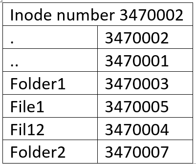

04.04.25

В основе интерфейса VFS лежит 4 структуры:
- struct super_block    - описывает смонтированную ФС.
- struct inode          - описывает конкретный физический файл.
- struct dentry         - определяет элемент пути в имени файла.
- struct file           - дескриптор открытого файла в системе.

Цель интерфейса VFS - поддерживать большое количество различных файловых систем.

struct super_block - описывает смонтированную ФС.

struct super_operations - определяет действия определенные в системе над суперблоком

alloc_super - функция размещает и инициализирует структуру super_block
Любой файл принадлежит какой то определнной файловой системе и значит эта файловая система должна иметь информацию о файлах, которая позволит выполнять обращение к данным записанным в файл
```C
/**
 *	alloc_super	-	create new superblock
 *	@type:	filesystem type superblock should belong to
 *	@flags: the mount flags
 *	@user_ns: User namespace for the super_block
 *
 *	Allocates and initializes a new &struct super_block.  alloc_super()
 *	returns a pointer new superblock or %NULL if allocation had failed.
 */
static struct super_block *alloc_super(struct file_system_type *type, int flags,
				       struct user_namespace *user_ns) {
	struct super_block *s = kzalloc(sizeof(struct super_block), GFP_KERNEL);
	static const struct super_operations default_op;
	...
	INIT_LIST_HEAD(&s->s_mounts);
    ...
    INIT_LIST_HEAD(&s->s_inodes);
    ...
}
```

```C
struct super_operations {
   	struct inode *(*alloc_inode)(struct super_block *sb);
	void (*destroy_inode)(struct inode *);
	void (*free_inode)(struct inode *);

   	void (*dirty_inode) (struct inode *, int flags);
	int (*write_inode) (struct inode *, struct writeback_control *wbc);
	int (*drop_inode) (struct inode *);
	void (*evict_inode) (struct inode *);
	void (*put_super) (struct super_block *);
	int (*sync_fs)(struct super_block *sb, int wait);
	int (*freeze_super) (struct super_block *);
	int (*freeze_fs) (struct super_block *);
	int (*thaw_super) (struct super_block *);
	int (*unfreeze_fs) (struct super_block *);
	int (*statfs) (struct dentry *, struct kstatfs *);
	int (*remount_fs) (struct super_block *, int *, char *);
	void (*umount_begin) (struct super_block *);

	int (*show_options)(struct seq_file *, struct dentry *);
	int (*show_devname)(struct seq_file *, struct dentry *);
	int (*show_path)(struct seq_file *, struct dentry *);
	int (*show_stats)(struct seq_file *, struct dentry *);
#ifdef CONFIG_QUOTA
	ssize_t (*quota_read)(struct super_block *, int, char *, size_t, loff_t);
	ssize_t (*quota_write)(struct super_block *, int, const char *, size_t, loff_t);
	struct dquot **(*get_dquots)(struct inode *);
#endif
	long (*nr_cached_objects)(struct super_block *,
				  struct shrink_control *);
	long (*free_cached_objects)(struct super_block *,
				    struct shrink_control *);
};
```

# Узлый inode и dentry
inode - index node

struct inode - описывает конкретный физический файл.

struct file - дескриптор открытого файла в системе.

struct dentry - определяет элемент пути в имени файла или же это структура которая представляет соответствующую директорию. С др стороны имя файла состоит из собственного имени файла и пути к файлу начиная с корневого каталога. 

Вся информация о директорих должна хранится на диске.

Структура struct dentry не соответствует никакой структуре на диске. Директории это такие же файлы как обычные файлы при этом содержимое файла директории это те файлы и поддиректории которые находятся в соответствующей директории.

Чтобы получить доступ к файлу система проходит все элементы пути.

Каталог можно удалить когда на него нет больше ссылок.

Какие то каталоги могут быть определены в системе как несмонтированные.

```C
struct dentry {
    ...
    struct hlist_bl_node d_hash;	/* lookup hash list, для ускорения прохода по директориям */
	struct dentry *d_parent;	/* parent directory */
    struct qstr d_name;
	struct inode *d_inode;		/* указатель на связный inode */
    unsigned char d_iname[DNAME_INLINE_LEN];	/* small names */
	
	struct lockref d_lockref;	/* per-dentry lock and refcount */
	const struct dentry_operations *d_op; /* действия которые определены на struct dentry */
	struct super_block *d_sb;	/* файл-директория находится в определенной файловой системе */
	// unsigned long d_time;		/* used by d_revalidate */
	// void *d_fsdata;			/* fs-specific data */

	union {
		struct list_head d_lru;		/* LRU list */
		wait_queue_head_t *d_wait;	/* in-lookup ones only */
	};
	struct list_head d_child;	/* child of parent list */
	struct list_head d_subdirs;	/* our children */
	/*
	 * d_alias and d_rcu can share memory
	 */
	union {
		struct hlist_node d_alias;	/* inode alias list */
		struct hlist_bl_node d_in_lookup_hash;	/* only for in-lookup ones */
	 	struct rcu_head d_rcu;
	} d_u;
} __randomize_layout;
```

## dentry state
Обьект dentry может находится в 1 из 3х состояний:
1 - in use - используется 
2 - unused - не используется 
3 - negative - не связанный с допустимым индексным узлом (*d_inode = NULL)

dentry - не имеет структуры которая хранилась бы на диске - рассматриваются системой как файлы

Для того чтобы каждый раз не обращаться к диску за информацией которая хранится в файле dentry, эта информация когда происходит проход по пути к файлу записывается в кеш

И прежде чем обращаться к диску информация об элементе пути ищется в кеше

cache dentry состоит из 3х частей:
1 - список актуальных обращений. может быть несколько обьектов dentry имеющих один и тот же inode
2 - двусвязный список dentry LRU (наименее используемый в последнее время), т е список отсортированный по времени обращения к dentry

Есть 2 способа организации алгоритма LRU: временная метка. Если в ядре возникает необходимость очищения памяти то будут удалены обьекты находящиеся в конце списка 

3 - хеш таблица и функции хеширования: используется для быстрого преобразования заданного пути к указанному файлу. Хеш балица представляется в виде массива dentry_hashtable, в которой каждый элемент является указателем на список dentry. Размер таблицы зависисит от доступтого обьема физической памяти в системе

Пример

/mhome/mydir/cf/my_server.c

При каждом обращении к файлу my_server.c ВФС должна пройти по всем dentry данного имени файла, начиная с корневого каталога: /, mhome, mydir, cf, my_server. Если бы не было кеша пришлось бы каждый раз обращаться к диску

```C
// действия которые определены на struct dentry
struct dentry_operations {
	int (*d_revalidate)(struct dentry *, unsigned int);
	int (*d_hash)(const struct dentry *, struct qstr *);
	int (*d_compare)(const struct dentry *, unsigned int, const char *, const struct qstr *);
	int (*d_delete)(const struct dentry *);
	void (*d_release)(struct dentry *);
	void (*d_iput)(struct dentry *, struct inode *);
	// int (*d_weak_revalidate)(struct dentry *, unsigned int);
	// int (*d_init)(struct dentry *);
	// void (*d_prune)(struct dentry *);
	// char *(*d_dname)(struct dentry *, char *, int);
	// struct vfsmount *(*d_automount)(struct path *);
	// int (*d_manage)(const struct path *, bool);
	// struct dentry *(*d_real)(struct dentry *, const struct inode *);
} ____cacheline_aligned;
```
d_revalidate - Проверяет, является ли dentry актуальным (не устаревшим). (некоторые ФС устанавливают NULL потому что их обьекты dentry всегда валидные)

d_hash - создает хеш значение для указанного dentry (когда надо добавить dentry в хеш таблицу)

d_compare - сравнение имен файлов (При поиске файла в каталоге)

d_delete - Вызывается, когда последняя ссылка на dentry исчезает (счётчик d_count становится нулевым)

d_release - Когда dentry удаляется из памяти 

d_iput - вызывается когда обьект dentry теряет связанный inode

## inode

inode - описывает физический файл (реально существующий). Такой файл может находиться во вторичной или физической памяти. В любом случае файл будет иметь представление в системе в виде обьекта inode - проинициализированной структуры inode.

В linux существует 2 типа структуры inode:
1 - структура inode ядра - содержит информацию о физическом файле, позволяет быстрее получать информацию о файле
2 - дисковый inode - содержит информацию об адресах блоков диска в которых хранятся данные этого файла 

номер inode это метаинформация. Общачение к inode происходит по номеру inode - это и есть идентификатор файла

```C
struct inode {
	umode_t			i_mode;
	unsigned short		i_opflags;
	kuid_t			i_uid;
	kgid_t			i_gid;
	unsigned int		i_flags;
	...
	const struct inode_operations	*i_op;
	struct super_block	*i_sb;	/* любой файл принадлежит опреленной ФС */
	struct address_space	*i_mapping;
#ifdef CONFIG_SECURITY
	void			*i_security;
#endif
	/* Stat data, not accessed from path walking */
	unsigned long		i_ino;	/* индекс inode */
	...
	dev_t			i_rdev;
	loff_t			i_size;
	struct timespec64	i_atime;
	struct timespec64	i_mtime;
	struct timespec64	i_ctime;
	...
	/* Misc */
	unsigned long		i_state;
	struct rw_semaphore	i_rwsem;

	unsigned long		dirtied_when;	/* jiffies of first dirtying */
	unsigned long		dirtied_time_when;
	...
	struct list_head	i_lru;		/* inode LRU list */
	...
	union {
		const struct file_operations	*i_fop;	/* former ->i_op->default_file_ops */
		void (*free_inode)(struct inode *);
	};
	...
	union {
		struct pipe_inode_info	*i_pipe;
		struct cdev		*i_cdev;
		char			*i_link;
		unsigned		i_dir_seq;
	};
	...
	void			*i_private; /* fs or device private pointer */
} __randomize_layout;
```


18.04.25

dirtied_when - контролирование когда информация меняется - она сначала меняется в ядре потом переносится на диск

```C
struct inode_operations {
	struct dentry * (*lookup) (struct inode *,struct dentry *, unsigned int);
	int (*create) (struct user_namespace *, struct inode *,struct dentry *, umode_t, bool);
	int (*link) (struct dentry *,struct inode *,struct dentry *);
	int (*symlink) (struct user_namespace *, struct inode *,struct dentry *, const char *);
	int (*mkdir) (struct user_namespace *, struct inode *,struct dentry *, umode_t);
	...
} ____cacheline_aligned;
```
ПРОРАБОТАТЬ САМИМ

create - создание дескриптора файла

Структура inode каталога



У родительской директории идентификатор меньше

Пример показывает шаги при доступе к файлу /usr/ast/mbox

- / - корневой каталог
- usr - директория
- ast - директория
- mbox - файл


(for lec.docx)

Inode index	
1	.
1	..
4	bin
5	lib
6	usr

Inode 6 is for usr. Обьект inode(дисковый) хранит номер блока, на котором хранится информация о директории usr (информация о директории usr находится в блоке 132)

Block 132 is /usr directory
Inode index	
6	.
1	..
10	Dir1
11	File1
26	ast

Inode 26 is for /usr/ast. Обьект inode(дисковый) хранит номер блока, на котором хранится информация о директории usr (информация о директории usr находится в блоке 406)
Block 406 is /usr/ast directory
Inode index	
26	.
6	..
20	Dir1
21	File1
60	mbox

файл mbox будет иметь номер inode = 60

Если в кеше такой dentry не найдет то будет выполненая такая последовательность действий


## своя файловая система

Ядро предоставляет возмодность создать свою файловую систему

```C
struct file_system_type {
	const char *name;	// название ФС
	int fs_flags;
#define FS_REQUIRES_DEV		1 
#define FS_BINARY_MOUNTDATA	2
#define FS_HAS_SUBTYPE		4
#define FS_USERNS_MOUNT		8	/* Can be mounted by userns root */
#define FS_DISALLOW_NOTIFY_PERM	16	/* Disable fanotify permission events */
#define FS_ALLOW_IDMAP         32      /* FS has been updated to handle vfs idmappings. */
#define FS_RENAME_DOES_D_MOVE	32768	/* FS will handle d_move() during rename() internally. */
	// int (*init_fs_context)(struct fs_context *);
	// const struct fs_parameter_spec *parameters;
	struct dentry *(*mount) (struct file_system_type *, int, const char *, void *); // указание на смонтированную ФС
	void (*kill_sb) (struct super_block *); // обеспечивает прекращение достука к суперблоку
	struct module *owner;	// владельцем является загружаемый модуль ядра
	struct file_system_type * next;	// 
	struct hlist_head fs_supers;	// список обьектов типа суперблок
	// средста блокировок
	// struct lock_class_key s_lock_key;
	// struct lock_class_key s_umount_key;
	// struct lock_class_key s_vfs_rename_key;
	// struct lock_class_key s_writers_key[SB_FREEZE_LEVELS];
	// struct lock_class_key i_lock_key;
	// struct lock_class_key i_mutex_key;
	// struct lock_class_key invalidate_lock_key;
	// struct lock_class_key i_mutex_dir_key;
};
```

В системе может существовать только 1 тип файловой системы, но ФС данного типа может быть смонтирована много раз. Только смонтированная ФС предосталвет доступ к своим файлам (когда она стала частью дерева каталогов).

```C
// block device
extern struct dentry *mount_bdev(struct file_system_type *fs_type,
	int flags, const char *dev_name, void *data,
	int (*fill_super)(struct super_block *, void *, int));

extern struct dentry *mount_single(struct file_system_type *fs_type,
	int flags, void *data,
	int (*fill_super)(struct super_block *, void *, int));

extern struct dentry *mount_nodev(struct file_system_type *fs_type,
	int flags, void *data,
	int (*fill_super)(struct super_block *, void *, int));

extern struct dentry *mount_subtree(struct vfsmount *mnt, const char *path);
```

**fill_super** - функция выполняет основныее действия:
1 - заполняет поля структуры суперблок 
2 - создает inode корневого каталога (чтобы смонтировать ФС надо как минимум создать ее корневой каталог)


В ядре есть 2 вида функций generic и little

Минимальная инициализация struct file_system_type = {
	.owner = THIS_MODULE,
	.name = "my_fs",
}

... my_init() {
	return register_filesystem(...)
}
... my_init() {
	return unregister_filesystem(...)
}

в proc можно увидеть зарегистрированную ФС