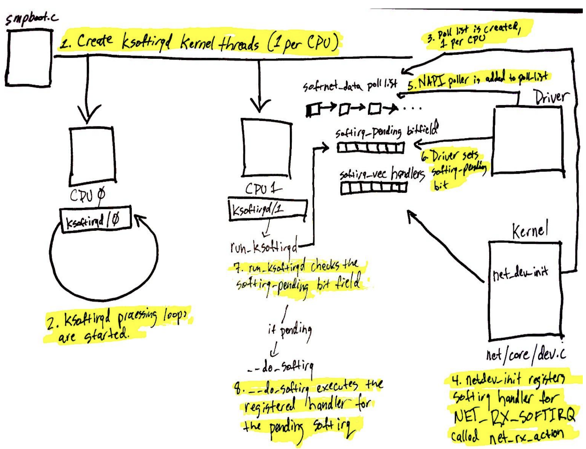
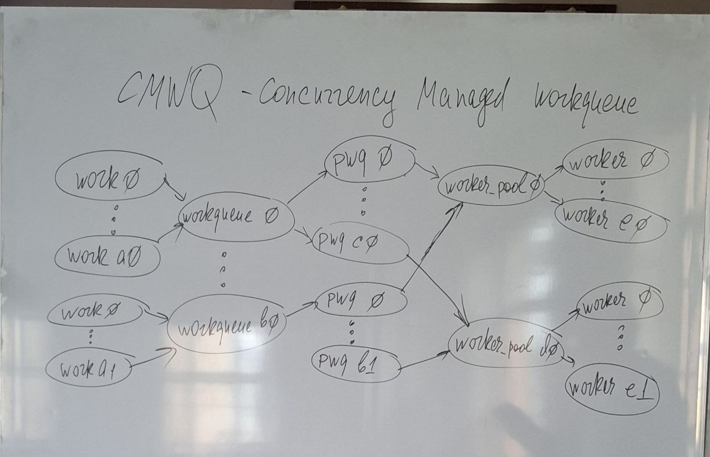
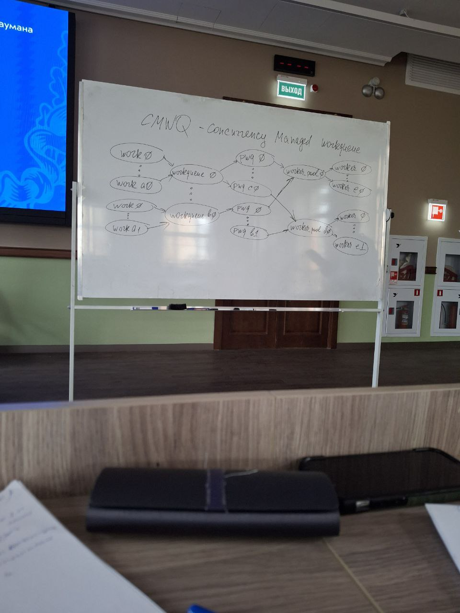
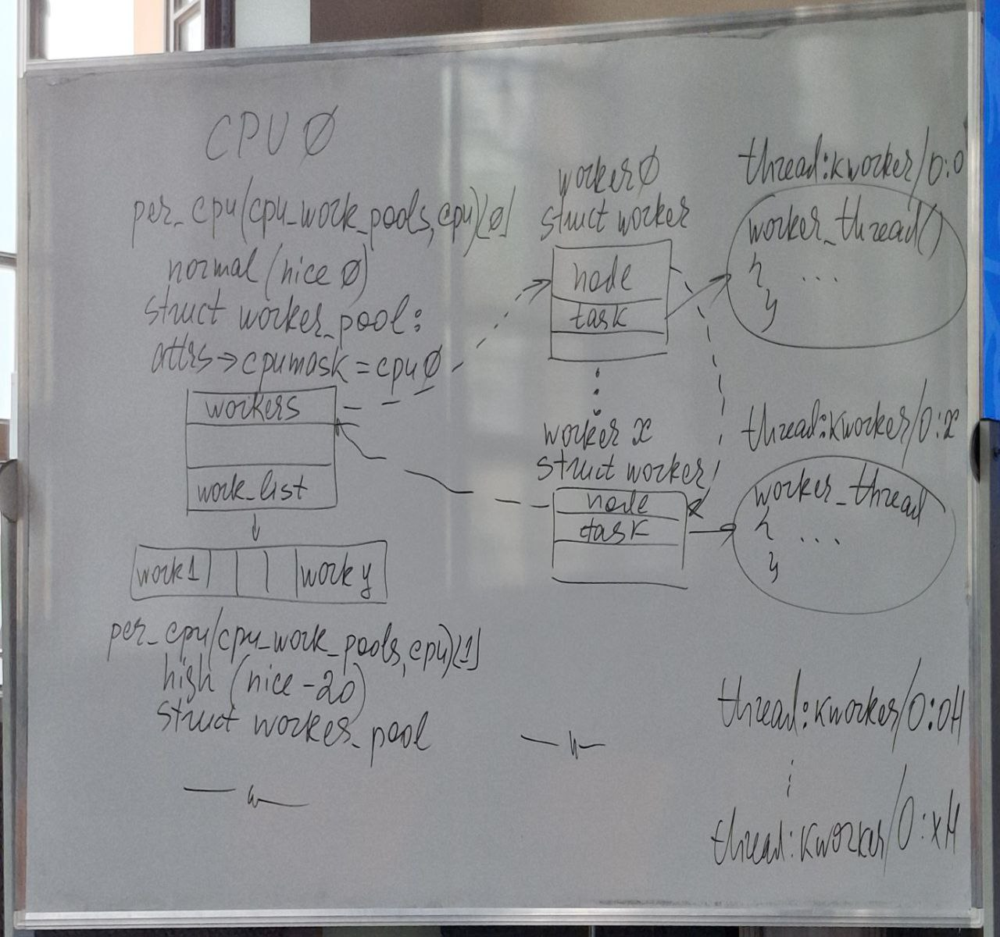
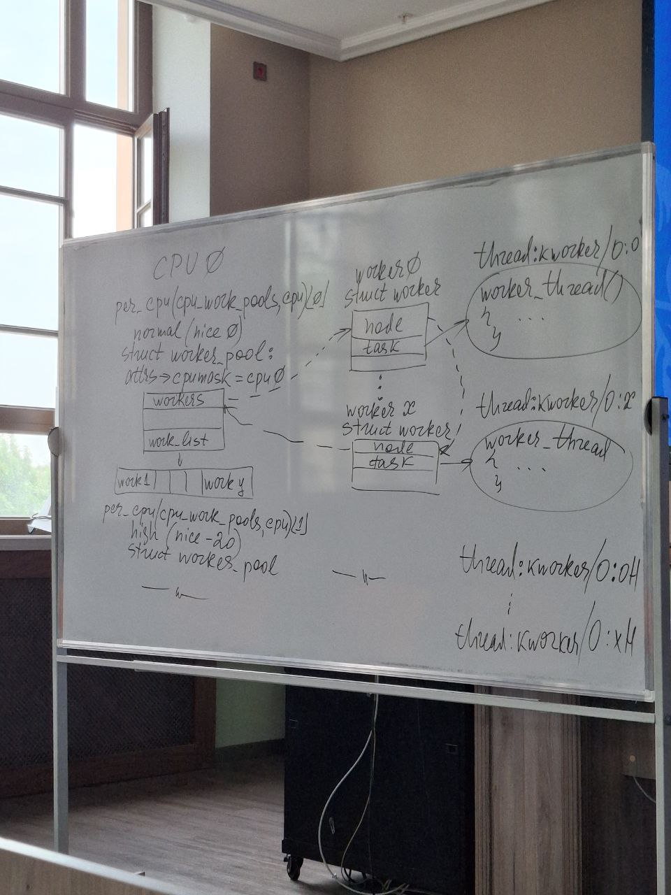

# Аппаратные прерывания

IBM360 - появились прерывания, т к в основу ее архитектуры был положен принцип распараллеливания функций. Для освобождения процессора от ожидания завершения ввода запрощенных процессом данных. Эту функцию переложили на каналы - появилась канальная архитектура.

Каналы начали управлять внешними устройствами и появилась **задача информирования процессора о завершении ввода/вывода** - эту задачу решают аппаратные прерывания - прерывания от устройств ввода/вывода (самая большая группа аппаратных прерываний)

Аппаратные прерывания:
- прерывания от системного таймера (единственное периодическое)
- прерывания от устройств ввода/вывода

Программируемый контроллен прерываний PIC

В персональный компьютерах реализована шинная архитектура. Управление внешними устройствми передано контроллерам (или адаптерам). Адаптеры как правило располагаются на материнской плате а контролеры входят в состав внешних устройств.

В 32 разрыдных устройствах количества пинов стало нехватать, использовали расширители.

В современных системах применяется **реализация прерываний от внешних устройств в виде сообщений (MSI)**. Это поддерживается специальной подсистемой.

Подсистема ввода/вывода является наиболее сложной с точки зрения програмного обеспечения подсистемной ОС.

Драйвера - специальные программы, которые управляют внешними устройствами. Для каждого типа устройства пишется специальный драйвер. В состав таких драйверов входит 1 обработчик прерывания для поддержания 1 функции внешнего устройства.

Мы можем написать свой обработчик прерывания.


Ядро позволяет зарегистрировать нам свой обработчик прерывания. Он не сможет заменить основной обработчик прерывания устройства

```C
typedef irqreturn_t (*irq_handler_t)(int, void *);

/**
 * request_irq - Add a handler for an interrupt line
 * @irq:	The interrupt line to allocate
 * @handler:	Function to be called when the IRQ occurs.
 *		Primary handler for threaded interrupts
 *		If NULL, the default primary handler is installed
 * @flags:	Handling flags
 * @name:	Name of the device generating this interrupt
 * @dev:	A cookie passed to the handler function
 *
 * This call allocates an interrupt and establishes a handler; see
 * the documentation for request_threaded_irq() for details.
 */
static inline int __must_check
request_irq(unsigned int irq, irq_handler_t handler, unsigned long flags, const char *name, void *dev) {
	return request_threaded_irq(irq, handler, NULL, flags, name, dev);
}

extern const void *free_irq(unsigned int, void *);
```

irq - номер линии прерывания

name - не обязательный
dev - параметр позволяет указать имя обработчика прерывания чтобы иметь возможность освободить линию irq от нашего обработчика.

__must_check - макрос, чтобы система проверила допустимость действия

Когда возникает прерывания по указанной линии прерывания, вызывается обработчик прерывания. (каком образом DOS вызывает обработчик прерывания? схема??)

Последовательность обработки: В результате возникновения прерывания формируется вектор прерывания, который является смещением к дескриптору прерывания в таблице векторов прерывания. А в этой таблице находится смещение к обработчику прерывания, который находится в определенном сегменте кода. И в результате формирования абсолютного адреса обработчика прерывания, систмема переходит по этому адресу и начинает выполнятся обработчик прерывания

в 64битной системе не используется таблица векторов прерываний начиная с нулевого адреса. Для этого в системах существует специальная таблица - iterrupt descriptor table + 16 специальная выделенных прерываний
 
Прерывания от системного таймера и от клавиатуры ps/2 име.т номера 0 и 1

Как добавлять прерывание если линия уже занята родным обработчкиком который можно увидеть через proc/. 
IRQF_SHARED - возможность разделения 1 линии прерывания несколькими обработчиками прерывания.

В системе существует 1 быстрое прерывание - прерывание от системного таймера. Он не может быть распараллелен и не выполняться на разных ядрах. Условно выделяется главный процессор который обрабатывает прерывания от системного таймера.

#define IRQF_TIMER		(__IRQF_TIMER | IRQF_NO_SUSPEND | IRQF_NO_THREAD)

```C
/*
 * These flags used only by the kernel as part of the
 * irq handling routines.
 *
 * IRQF_SHARED - allow sharing the irq among several devices
 * IRQF_PROBE_SHARED - set by callers when they expect sharing mismatches to occur
 * IRQF_TIMER - Flag to mark this interrupt as timer interrupt
 * IRQF_PERCPU - Interrupt is per cpu
 * IRQF_NOBALANCING - Flag to exclude this interrupt from irq balancing
 * IRQF_IRQPOLL - Interrupt is used for polling (only the interrupt that is
 *                registered first in a shared interrupt is considered for
 *                performance reasons)
 * IRQF_ONESHOT - Interrupt is not reenabled after the hardirq handler finished.
 *                Used by threaded interrupts which need to keep the
 *                irq line disabled until the threaded handler has been run.
 * IRQF_NO_SUSPEND - Do not disable this IRQ during suspend.  Does not guarantee
 *                   that this interrupt will wake the system from a suspended
 *                   state.  See Documentation/power/suspend-and-interrupts.rst
 * IRQF_FORCE_RESUME - Force enable it on resume even if IRQF_NO_SUSPEND is set
 * IRQF_NO_THREAD - Interrupt cannot be threaded
 * IRQF_EARLY_RESUME - Resume IRQ early during syscore instead of at device
 *                resume time.
 * IRQF_COND_SUSPEND - If the IRQ is shared with a NO_SUSPEND user, execute this
 *                interrupt handler after suspending interrupts. For system
 *                wakeup devices users need to implement wakeup detection in
 *                their interrupt handlers.
 * IRQF_NO_AUTOEN - Don't enable IRQ or NMI automatically when users request it.
 *                Users will enable it explicitly by enable_irq() or enable_nmi()
 *                later.
 * IRQF_NO_DEBUG - Exclude from runnaway detection for IPI and similar handlers,
 *		   depends on IRQF_PERCPU.
 */
#define IRQF_SHARED		0x00000080
#define IRQF_PROBE_SHARED	0x00000100
#define __IRQF_TIMER		0x00000200
#define IRQF_PERCPU		0x00000400
#define IRQF_NOBALANCING	0x00000800
#define IRQF_IRQPOLL		0x00001000
#define IRQF_ONESHOT		0x00002000
#define IRQF_NO_SUSPEND		0x00004000
#define IRQF_FORCE_RESUME	0x00008000
#define IRQF_NO_THREAD		0x00010000
#define IRQF_EARLY_RESUME	0x00020000
#define IRQF_COND_SUSPEND	0x00040000
#define IRQF_NO_AUTOEN		0x00080000
#define IRQF_NO_DEBUG		0x00100000

#define IRQF_TIMER		(__IRQF_TIMER | IRQF_NO_SUSPEND | IRQF_NO_THREAD)
```


struct irqaction - дескриптор действия прерывания
```C
/**
 * struct irqaction - per interrupt action descriptor
 * @handler:	interrupt handler function
 * @name:	name of the device
 * @dev_id:	cookie to identify the device
 * @percpu_dev_id:	cookie to identify the device
 * @next:	pointer to the next irqaction for shared interrupts
 * @irq:	interrupt number
 * @flags:	flags (see IRQF_* above)
 * @thread_fn:	interrupt handler function for threaded interrupts
 * @thread:	thread pointer for threaded interrupts
 * @secondary:	pointer to secondary irqaction (force threading)
 * @thread_flags:	flags related to @thread
 * @thread_mask:	bitmask for keeping track of @thread activity
 * @dir:	pointer to the proc/irq/NN/name entry
 */
struct irqaction {
	irq_handler_t		handler;    
	void			*dev_id;                // идентификатор устройства
	void __percpu		*percpu_dev_id;     // идентификатор привязанный в cpu
	struct irqaction	*next;              // односвязный список
	irq_handler_t		thread_fn;
	struct task_struct	*thread;
	struct irqaction	*secondary;
	unsigned int		irq;                // номер линии прерывания
	unsigned int		flags;
	unsigned long		thread_flags;
	unsigned long		thread_mask;
	const char		*name;
	struct proc_dir_entry	*dir;           // pointer to proc/irq/NN/name_entry
} ____cacheline_internodealigned_in_smp;
```

MSI - прерывания сигнализируются сообщениями

## Быстрые/медленные прерывания 

В системе есть только 1 быстрое прерывания - прерывание от системного таймера. Обработчики быстрых прерываний выполняются полностью: от начала до конца на высочайших уровнях привелегий.

Медленные прерывания делять на 2 части:
- top half      
- bottom half

top half - аппаратные прерывания  (в обработчике минимально необходимый обьем действий). Минимальный обьем действия когда возникло прерывание: сохранение полученных данный в буфер ядра. 

Все остальные действия по завершению обработки прерывания выполняет bottom half 

В современных системах существует 3 типа bottom half.
1 - softirq - гибкие прерывания
2 - tasklets
3 - work queue

Вторая половина прерывания это классическое отложенное действие.

Можно посмотреть установленные в системе обработчики прерывания через /proc/interrupts

Вывод: /proc/interrupts

номер_IRQ количество_прерываний_на_CPU контроллер

### Гибкие прерывания (softirq)

Определены в <linux/interrupt.h>

**softirq** - это отложенные действия, которые определяются статически, т е во время компиляции ядра.

```C
/* map softirq index to softirq name. update 'softirq_to_name' in
 * kernel/softirq.c when adding a new softirq.
 */
extern const char * const softirq_to_name[NR_SOFTIRQS];

/* softirq mask and active fields moved to irq_cpustat_t in
 * asm/hardirq.h to get better cache usage.  KAO
 */

struct softirq_action
{
	void	(*action)(struct softirq_action *);
};
```
 
Определен массив экземпляров struct softirq_action. В ядре можно создать 32 обработчиков softirq. 

Именно softirq работают с сетевой подсистемой (определены для входящих и исходящих пакетов).

В настоящий моммент времени определено 10 обработчиков:

```C
enum
{
	HI_SOFTIRQ=0,   // высокоприоритетное softirq
	TIMER_SOFTIRQ,  // таймеры (програмируемые таймеры для контроля действия в систмене на время)
	NET_TX_SOFTIRQ, // отправка сетевых пакетов
	NET_RX_SOFTIRQ, // прием сетевых пакетов
	BLOCK_SOFTIRQ,  // блочные устроства
	IRQ_POLL_SOFTIRQ,
	TASKLET_SOFTIRQ,
	SCHED_SOFTIRQ,
	HRTIMER_SOFTIRQ,    // не используется
	RCU_SOFTIRQ,    /* Preferable RCU should always be the last softirq */

	NR_SOFTIRQS
};
```

Обратить внимание:
NET_TX_SOFTIRQ, // отправка сетевых пакетов
NET_RX_SOFTIRQ, // прием сетевых пакетов
Предназначены для отложенной обработки входящих и выходящих пакетов 

```C
static struct softirq_action softirq_vec[NR_SOFTIRQS] __cacheline_aligned_in_smp;

const char * const softirq_to_name[NR_SOFTIRQS] = {
	"HI", "TIMER", "NET_TX", "NET_RX", "BLOCK", "IRQ_POLL",
	"TASKLET", "SCHED", "HRTIMER", "RCU"
};
```

Чем меньше номер тем выше приоритет.

Писать softirq ниже уровня приоритета tasklet не имеет смысла, лучше написать tasklet. tasklet как отложенные действия являются видом softirq. 

Для написания softirq надо будет перекомпилировать ядро:
```C
void __init mysoftirq_init(void) {
    ...
    request_irq(irq, xxx_interrupt, 0, "xxx", NULL);
    open_softirq(XXX_SOFTIRQ, xxx_handler, NULL);
    ...
}

void open_softirq(int nr, void (*action)(struct softirq_action *))
{
	softirq_vec[nr].action = action;
}

/* interrupt handler */
static irqreturn_t xxx_interrupt(int irq, void* dev_id) {
    /* mark softirq as pending */
    raise_softirq(xxx_SOFT_IRQ);
    ...
    return IRQ_HANDLER;
}

```

SMP-архитектура - равноправные процессоры. Они все могут || обрабатывать входящие пакеты

ksoftirqd - отслеживает ситуацию выполняя петлю цикла

```
ksoftirqd — это набор демонов ядра (по одному на каждый CPU), которые обрабатывают отложенные прерывания (softirqs), если их становится слишком много и они не могут быть обработаны сразу в контексте прерывания (hardirq).

1. Зачем нужен ksoftirqd?
Когда процессор получает аппаратное прерывание (IRQ), ядро Linux:

Быстро обрабатывает критическую часть в контексте прерывания (hardirq).

Откладывает менее срочные задачи в очередь softirq (например, обработку сетевых пакетов, таймеров).

Пытается обработать softirq сразу после hardirq, но:

Если softirq накапливаются быстрее, чем обрабатываются, они могут загрузить CPU на 100%.

Чтобы избежать бесконечного цикла, ядро передаёт обработку ksoftirqd.
```



Если рассматривать по времени:
1 - сначала мы запускаем систему, начинает выполнятся ksoftirqd
2 - он начинает крутится в цикле обработки
3 - он инициализирует список событий
4 - подключается сетевая подсистема, драйвер и уже он начинает в подсистему заносить информацию о событиях

NAPI - new api появилось в коде ядра в связи с тем что интенсивность работы с сетью в современных системах возросла. Если каждый входящий пакет будет приходить на сетевую карточку. Сетевая карточка это девайс, а с девайсами система работает через прерывания, но прерывание это очень затратное действие в системе.

Поступает большое количество пакетов => решение napi - замена прерываний опросом (polling)

**Прямой доступ к памяти** - это основной механизм вазаимодействия с устройствами. DMA - direct memory access. Если бы этого механизма не было, то для передачи данных от внешних устройств в память и из памяти на внешнее устройство постоянно задействовались регистры процессора, т е через них выполнялась бы передача данных. Т е процессов был бы загружен передачей данных вместо того чтобы обрабатывать эти данные.

DMA - основное средство передачи данных от внешних устройств в оперативную память.

Пакет через DMA помещается в кольцевой буфер в памяти - это означает добавления бита в очередь битов (6 пункт). Обрабатывать его будет отложенный обработчик. Код NET_RX_SOFTIRQ начинает выполняться. Управляет его выполнением ksoftirqd, он работает с этой битовой очередью, которая обозначет что существует событие которое требует обработки.

Сетевая водсистема Linux построена по примеру стека BSD. В ней прием и передача данных на транспортном и сетевом уровнях происходит в помощью интерфейса сокетов. **Основаня цель NAPI** - сократить количество прерываний генерируемых при получаении пакетов. В NAPI механизм прерываний сочетается с механизмом опроса.
 
В NAPI-совместимых драйверах прерывания отключаются когда на интерфаейс приходит пакет. Обработчик в этом случает только вызывает rx_schedule что гарантирует обработку пакета в дальнейшем.


### tasklets

tasklets - это частный случай реализации softirq. Но softirq можно сериализировать, т е один и тот же тип softirq может выполнятся || на разных процессорах, поэтому в softirq должно быть реализовано взаимоисключаение.

tasklets - не может сериализоваться - один тип tasklet может выполнятся только на 1 процессоре одновременно. Но разные tasklets могут выполнятся параллельно.

tasklets не могут использоваться для обработки нагруженных действий, подобных сетевым пакетам.

softirq - регистрируется статически при инициализации системы в ядре. tasklets могут быть зарегистрированы как статически так и динамически 

Свойства:
* Если вызывается функция tasklet_schedule(), то после этого tasklet гарантированно будет
выполнен на каком-либо процессоре хотя бы один раз.
* Если тасклет уже запланирован, но его выполнение все еще не запущено, он будет выполнен
только один раз.
* Если этот тасклет уже запущен на другом процессоре (или schedule вызывается из самого
тасклета), оно переносится на более поздний срок.
* Тасклет строго сериализован по отношению к самому себе, но не по отношению к другим
тасклетам. Если клиенту нужна некоторая межзадачная синхронизация, он делает это с
помощью spinlocks.

Тасклеты представлены двумя типами отложенных прерываний: HI_SOFTIRQ и TASKLET_SOFTIRQ. Единственная разница между ними в том, что тасклеты типа HI_SOFTIRQ выполняются всегда раньше тасклетов типа TASKLET_SOFTIRQ.

```C
/* Tasklets --- multithreaded analogue of BHs.

   This API is deprecated. Please consider using threaded IRQs instead:
   https://lore.kernel.org/lkml/20200716081538.2sivhkj4hcyrusem@linutronix.de

   Main feature differing them of generic softirqs: tasklet
   is running only on one CPU simultaneously.

   Main feature differing them of BHs: different tasklets
   may be run simultaneously on different CPUs.

   Properties:
   * If tasklet_schedule() is called, then tasklet is guaranteed
     to be executed on some cpu at least once after this.
   * If the tasklet is already scheduled, but its execution is still not
     started, it will be executed only once.
   * If this tasklet is already running on another CPU (or schedule is called
     from tasklet itself), it is rescheduled for later.
   * Tasklet is strictly serialized wrt itself, but not
     wrt another tasklets. If client needs some intertask synchronization,
     he makes it with spinlocks.
 */
struct tasklet_struct
{
	struct tasklet_struct *next;
	unsigned long state;
	atomic_t count;         // счетчик ссылок на tasklet
	bool use_callback;
	union {
		void (*func)(unsigned long data);
		void (*callback)(struct tasklet_struct *t);
	};
	unsigned long data;
};
```

значения поля state - текущее состояние tasklet
```C
enum
{
	TASKLET_STATE_SCHED,	/* Tasklet is scheduled for execution */
	TASKLET_STATE_RUN	/* Tasklet is running (SMP only) */
};
```

Если count==0 то tasklet можно выполнять, иначе нельзя. 

Для создания tasklet статически определены макросы:
- DECLARE_TASKLET (тасклет разрешен)
- DECLARE_TASKLET_DISABLED (тасклет не разрешен)
```C
#define DECLARE_TASKLET(name, _callback)		\
struct tasklet_struct name = {				\
	.count = ATOMIC_INIT(0),			\
	.callback = _callback,				\
	.use_callback = true,				\
}

#define DECLARE_TASKLET_DISABLED(name, _callback)	\
struct tasklet_struct name = {				\
	.count = ATOMIC_INIT(1),			\
	.callback = _callback,				\
	.use_callback = true,				\
}
```

Динамисекски таксклеты создаются с помощью фукнции:
```C
extern void tasklet_init(struct tasklet_struct *t, void (*func)(unsigned long), unsigned long data);
```
func - функция обработчик,
data - передаваемые данные


### Планирование tasklet

В init мы можем динамически зарегистрировать свой tasklet, а в обработчике прерывания запланировать выполнение функции tasklet. Для этого нам предоставляются функции 
```C
extern void __tasklet_schedule(struct tasklet_struct *t);	// использует отложенное прерывание с номером TASKLET_SOFTIRQ
extern void __tasklet_hi_schedule(struct tasklet_struct *t);	// с номером HI_SOFTIRQ
```
Тасклеты типа HI_SOFTIRQ выполняются всегда раньше тасклетов типа TASKLET_SOFTIRQ.

Когда tasklet запланирован, ему выставляется состояние TASKLET_STATE_SCHED, и тон добавляется в очередь. Пока он находится в этом состоянии, запланировать его еще раз не получится, т.е. в этом случае просто ничего не произойдет. Tasklet не может находиться сразу в нескольких местах очереди на планирование, которая организуется через поле next структуры tasklet_struct.

После того, как тасклет был запланирован, он выполниться только один раз.

```
Важнейшая особенность: тасклеты не могут быть блокированы
```
Поэтому семафаоры в тасклетах использоваться не могут. Только spinlock. 

В SMP ахитектурах могут использоваться функции
```C
#if defined(CONFIG_SMP) || defined(CONFIG_PREEMPT_RT)
static inline int tasklet_trylock(struct tasklet_struct *t)
{
	return !test_and_set_bit(TASKLET_STATE_RUN, &(t)->state);
}

void tasklet_unlock(struct tasklet_struct *t);
```

Альтернативой тасклетам являются очереди работ


лек 9 30.05.25

Наибольшее количество изменений очередей работ было произведено в версии ядра 2.6.36 для адаптации к || выполнений -- появление SMP архитектуры. Все процессоры равноправны и работают с общей памятью. Появилась необходимость включаения в этот чипсет кешей L1 L2 L3. L1 L2  -- принадлежат каждому ядру, L3 -- общий кеш. Кроме них в чипсете есть кеш TLB.

Неостаются неизменными физические особенности машин, но софт меняется не так кооридинально. Иначе не будет работать то что работало ранее.

## Сравнение tasklet и очередей работ

Задача ОР такая же как у Т, они также относятся к bottom half -- возможность представления отложенных действий.

Отличия:

Т - выполняется в контексте програмного обеспечения прерывания => кол Т должен быть неделимым.
ОР - выполняются в контексте специалиного потока ядра => являются более гибкими и могут блокироваться.

Т - всегда выполняется на процессоре на котором завергилась обработка аппаратного прерывания (т е top half), которая и поставилас Т в очередь на выполнение.
ОЧ - по умолчанию ОЧ выполняется также, но можно поменять процессор

Код ядра может потребовать чтобы выполнение функции обработчика очереди было отложено на некоторое время.

```C
/**
 * alloc_workqueue - allocate a workqueue
 * @fmt: printf format for the name of the workqueue
 * @flags: WQ_* flags
 * @max_active: max in-flight work items, 0 for default (ограничивает число задача кот могут выполнятся || назодясь в 1 очередеи)
 * remaining args: args for @fmt
 *
 * Allocate a workqueue with the specified parameters.  For detailed
 * information on WQ_* flags, please refer to
 * Documentation/core-api/workqueue.rst.
 *
 * RETURNS:
 * Pointer to the allocated workqueue on success, %NULL on failure.
 */
__printf(1, 4) struct workqueue_struct *
alloc_workqueue(const char *fmt, unsigned int flags, int max_active, ...);

// в старых версиях ядра
#define create_workqueue(name)						\
	alloc_workqueue("%s", __WQ_LEGACY | WQ_MEM_RECLAIM, 1, (name))
```

```C
/*
 * The externally visible workqueue.  It relays the issued work items to
 * the appropriate worker_pool through its pool_workqueues.
 */
struct workqueue_struct {
	struct list_head	pwqs;		/* WR: all pwqs of this wq */
	struct list_head	list;		/* PR: list of all workqueues */

	// struct mutex		mutex;		/* protects this wq */
	// int			work_color;	/* WQ: current work color */
	// int			flush_color;	/* WQ: current flush color */
	// atomic_t		nr_pwqs_to_flush; /* flush in progress */
	struct wq_flusher	*first_flusher;	/* WQ: first flusher */
	struct list_head	flusher_queue;	/* WQ: flush waiters */
// 	struct list_head	flusher_overflow; /* WQ: flush overflow list */

// 	struct list_head	maydays;	/* MD: pwqs requesting rescue */
// 	struct worker		*rescuer;	/* MD: rescue worker */

// 	int			nr_drainers;	/* WQ: drain in progress */
// 	int			saved_max_active; /* WQ: saved pwq max_active */

// 	struct workqueue_attrs	*unbound_attrs;	/* PW: only for unbound wqs */
// 	struct pool_workqueue	*dfl_pwq;	/* PW: only for unbound wqs */

// #ifdef CONFIG_SYSFS
// 	struct wq_device	*wq_dev;	/* I: for sysfs interface */
// #endif
// #ifdef CONFIG_LOCKDEP
// 	char			*lock_name;
// 	struct lock_class_key	key;
// 	struct lockdep_map	lockdep_map;
// #endif
	char			name[WQ_NAME_LEN]; /* I: workqueue name */

	// /*
	//  * Destruction of workqueue_struct is RCU protected to allow walking
	//  * the workqueues list without grabbing wq_pool_mutex.
	//  * This is used to dump all workqueues from sysrq.
	//  */
	// struct rcu_head		rcu;

	// /* hot fields used during command issue, aligned to cacheline */
	// unsigned int		flags ____cacheline_aligned; /* WQ: WQ_* flags */
	struct pool_workqueue __percpu *cpu_pwqs; /* I: per-cpu pwqs */
	struct pool_workqueue __rcu *numa_pwq_tbl[]; /* PWR: unbound pwqs indexed by node */
};
```

```C
struct work_struct {
	atomic_long_t data;
	struct list_head entry;
	work_func_t func;
#ifdef CONFIG_LOCKDEP
	struct lockdep_map lockdep_map;
#endif
};
```
Эта структура предоставляет work-задачу которую решает конкретнай обработчик bottom-half. Экземпляр этой структуры помещается в очередь работ.

Проинициалихировать работу можно статически и динамически:
Статически (во время компиляции): 
```C
#define DECLARE_WORK(n, f)						\
	struct work_struct n = __WORK_INITIALIZER(n, f)
// n - имя струткуры work_struct
// f - функция которая будет выполнятся
```

Динамически:
```C
INIT_WORK(sruct work_struct *work, void (*func)(void),void *data);
PREPARE_WORK(sruct work_struct *work, void (*func)(void),void *data);
```
Рекомендуется при первой инициализации работы использовать INIT_WORK, так как он работает более детально. Если надо еще раз инициализировать работу то испольваться PREPARE_WORK, чтобы не повторять уже выполненные действия по инициализации

Добавить работу (объект work) в очередь работ:
```C
int queue_work( struct workqueue_struct *wq, struct work_struct *work );	// назначает работу текущему процессору
int queue_work_on( int cpu, struct workqueue_struct *wq, struct work_struct *work ); // позволяет указать процессор, на котором будет выполняться обработчик.
// создание отложенной работы (в которой инкапсулирована структура work_struct и таймер, определяющий задержку).
int queue_delayed_work( struct workqueue_struct *wq, struct delayed_work *dwork, unsigned long delay );
int queue_delayed_work_on( int cpu, struct workqueue_struct *wq, struct delayed_work *dwork, unsigned long delay );
```

Основная идея с которой были реализованы очереди работ: одна параллельная, множественна работа, в которой работы не должны блокировать друг друга. При это механизм строится с расчетом чтобы экономит ресурсы.

## Основные понятия CMWQ (Concurrency Managed Workqueue) 
Несколько объектов, связанных с очередью работ (workqueue), представлены в ядре соответствующими структурами:
1) Работа (work);
2) Очередь работ (workqueue) – коллекция work. Workqueue и work относятся как один-ко-многим;
3) Рабочий (worker). Worker соответствует потоку ядра worker_thread;
4) Пул рабочих потоков (worker_pool) это – набор рабочих (worker). Worker_pool и worker относятся как «один ко многим»;
5) Pwd (pool_workqueue) это – посредник, который отвечает за отношение workqueue и worker_pool: workqueue и pwd является отношением один-ко-многим, а pwd и worker_pool – отношение одинк-одному.








лек 10 4.06.25

В лабе исследование: тасклет быстрее выполняет необходимые действия (prio=120 policy=0 одинаковые). Играет рольчто тасклет планируется на том процессоре на котором выполняется прерывание и как правило по звершанию аппаратного прерывания выполняется стразу

```C
#define create_freezable_workqueue(name)				\
	alloc_workqueue("%s", __WQ_LEGACY | WQ_FREEZABLE | WQ_UNBOUND |	\
			WQ_MEM_RECLAIM, 1, (name))
```
WQ_FREEZABLE - может быть приостановлен
WQ_UNBOUND - 


4.06.25 15:00


