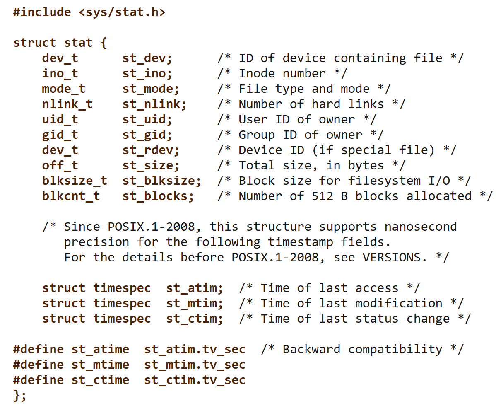
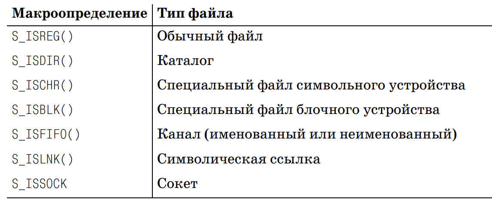
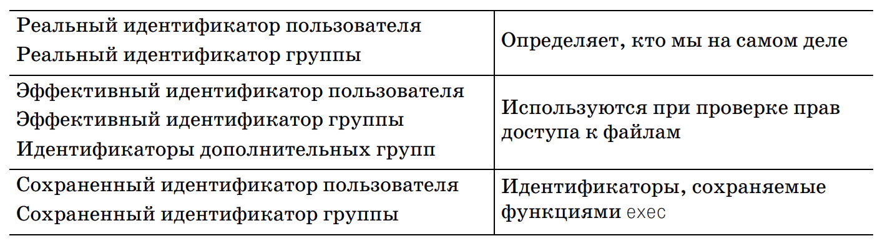

# Обход дерева каталогов

UNIX. Профессиональное программирование, 2-е издание. 4 глава. Листинг 4.7. 

Структура struct state описывуает файл и там есть поле тип, Но мы в отличие от этой программы будем выводить дерево каталогов. Считать файлы по типам не будем.

Рисунок 4.1 Дисковое устройство, разделы и файловая система.

Диск делится на partition (раздел) и на этом разделе устанавливается файловая система. И в начале устанавливается struct superblock. 

struct stat: права доступа, номер индексного узла, device, ...

Лаба режима пользователя. 

#### В конце раздела 4 упражнение - 4.11. 
Но не замеряем время, просто добавляем в программу chdir и переходим на кототки имена.




```C
struct stat {
    dev_t     st_dev;     // ID устройства, содержащего файл
    ino_t     st_ino;     // Номер inode
    mode_t    st_mode;    // Тип файла и права (например, S_IFREG | 0644)
    nlink_t   st_nlink;   // Количество жёстких ссылок
    uid_t     st_uid;     // UID владельца
    gid_t     st_gid;     // GID владельца
    dev_t     st_rdev;    // ID устройства (для специальных файлов)
    off_t     st_size;    // Размер файла в байтах
    blksize_t st_blksize; // Размер блока для I/O
    blkcnt_t  st_blocks;  // Количество выделенных блоков
    time_t    st_atime;   // Время последнего доступа
    time_t    st_mtime;   // Время последней модификации
    time_t    st_ctime;   // Время последнего изменения статуса
};
#include <sys/stat.h>
int stat(const char* pathname, struct stat* buf);
int fstat(int filedes, struct stat *buf);
int lstat(const char* pathname, struct stat buf);
```


**Стек** - организованный специальным образом участок памяти, который используется для временного хранения переменных, передачи параметров вызываемым подпрограммам и сохранения адреса возврата при вызове процедур и прерываний.


**Первое правило:** чтобы открыть файл любого типа по его полному имени, необходимо иметь право на исполнение для всех каталогов, указанных в имени файла, включая текущий. По этой причине бит права на исполнение для каталогов часто называют битом права на поиск.

*Право на чтение и право на исполнение для каталогов имеют разный смысл.* Право на чтение дает возможность прочитать файл каталога, получив полный список файлов, находящихся в нем. Право на исполнение дает возможность войти в каталог, когда он является одним из компонентов пути к файлу, к которому требуется получить доступ. (Чтобы отыскать нужный файл, необходимо выполнить поиск по каталогу).


1. Обычный файл – наиболее распространенный тип файлов, который хранит данные в том или ином виде. Ядро UNIX не делает различий между текстовыми и двоичными файлами. Любая интерпретация содержимого
файла полностью возлагается на прикладную программу, обрабатывающую файл.
2. Файл каталога. Файлы этого типа содержат имена других файлов и ссылки на информацию о них. Любой процесс, обладающий правом на чтение
каталога, может проверить его содержимое, но только ядро обладает правом на запись в файл каталога. Чтобы внести изменения в каталог, процессы должны пользоваться функциями, обсуждаемыми в данной главе.
3. Специальный файл блочного устройства. Этот тип файлов обеспечивает
буферизованный вводвывод для таких устройств, как дисковые устройства с фиксированным размером блока.
4. Специальный файл символьного устройства. Этот тип файлов обеспечивает небуферизованный вводвывод для устройств с переменным размером блока. Все устройства в системе являются либо специальными файлами
блочных устройств, либо специальными файлами символьных устройств.
5. FIFO, или именованный канал. Этот тип файлов используется для организации обмена информацией между процессами. Именованные каналы будут описаны в разделе 15.5.
6. Сокет. Этот тип файлов используется для организации обмена информацией между процессами через сетевые соединения. Сокеты можно применять и для обмена информацией между процессами на одной и той же машине. Мы будем использовать сокеты для организации взаимодействий между процессами в главе 16.
7. Символическая ссылка. Файлы этого типа представляют собой ссылки на другие файлы. 

Определить тип файла можно с помощью макроопределений



## Идентификаторы пользователя и группы, связанные с каждым процессом (4.4)



```C
// func - выводит информацию о файле
int dopath(const char *filename)
struct stat     statbuf;
if (lstat(filename, &statbuf) == -1) {...}
if (S_ISDIR(statbuf.st_mode) == 0) {  /* не каталог */
    return(func(filename, &statbuf)); }
func(filename, &statbuf);
if ((dp = opendir(filename)) == NULL) {...}
if (chdir(filename) == -1) {...}
while (ret == 0 && (dirp = readdir(dp)) != NULL) {
    if (strcmp(dirp->d_name, ".") != 0 && 
        strcmp(dirp->d_name, "..") != 0)
        ret = dopath(dirp->d_name);
} chdir(".."); closedir(dp);
```